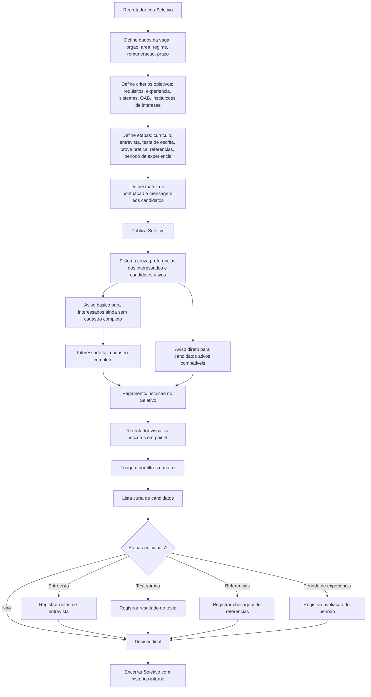

# Fluxograma Proposto - Seletivos JurisBank

## Pontos Para Validar

- O pagamento acontece no momento da inscricao no Seletivo, nao no cadastro basico de avisos.
- O cadastro basico apenas captura interesse e permite aviso de compatibilidade.
- O cadastro completo e necessario para participar e compartilhar perfil com recrutador.
- O recrutador precisa de poucos campos obrigatorios, mas suficientes para dar confianca: criterios, etapas e matriz.
- A decisao final continua humana; o JurisBank organiza informacoes, filtros e historico.
